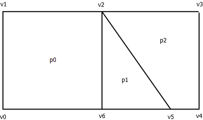

# HGeom 

**HGeom** is a Java library for creating and manipulating [half-edge data structure](https://en.wikipedia.org/wiki/Doubly_connected_edge_list)

A half-edge data structure is a model for representing a polygon mesh

It allows efficient topological operations on a mesh such as removing a vertex or an edge, splitting a polygon or merging 2 polygons

Traversals of meshes along vertices, edges or polygons are also efficiently performed with the help of a half-edge data structure

A half-edge data structure is modelized in **HGeom** by the Java class [HMesh](src/hgeom/hmesh/elements/HMesh.java)

To create a [HMesh](src/hgeom/hmesh/elements/HMesh.java), see below

Go [here](docs/hmesh_description.md) for a description of [HMesh](src/hgeom/hmesh/elements/HMesh.java)

Go [here](docs/hmesh_uses.md) for some examples of [HMesh](src/hgeom/hmesh/elements/HMesh.java) uses

## Creation of a half-edge data structure in **HGeom**
	
There are two ways to create a half-edge data structure with **HGeom**: 

### 1. Creation of a half-edge data structure from a list of polygons

A [HMesh](src/hgeom/hmesh/elements/HMesh.java) can be generated from a list of polygons where each polygon is defined by a list of indices to vertices.

Let's take this mesh as an example:  

<p align="center">
	
</p>

The mesh contains 7 vertices:

| Vertex indices | Vertices |
| :---: | :---: |
| 0     | v0       |       
| 1     | v1       |
| 2     | v2       |
| 3     | v3       |
| 4     | v4       |
| 5     | v5       |
| 6     | v6       |

and 3 polygons:

| Polygon indices | Polygon | Polygon definition as indices to vertices |
| :---: | :---: | :---: |
| 0 | p0 | [0, 1, 2, 6]
| 1 | p1 | [2, 5, 6]
| 2 | p2 | [2, 3, 4, 5]

To generate a [HMesh](src/hgeom/hmesh/elements/HMesh.java) from this mesh, we first create a **FaceSource** from the collection of polygons: 

```Java

   // The polygons as arrays of indices to vertices: 
   int[][] polygons = {{0, 1, 2, 6}, {2, 5, 6}, {2, 3, 4, 5}};

   // Build the face source. a FaceSource can be built from 
   // various types of iterable collection of faces / polygons
   FaceSource faceSource = new FaceSource(polygons);
   
```

We then convert the **FaceSource** into a **HMesh**: 

```Java

    Optional<HMesh> mesh = faceSource.toHMesh();
	
```
Or, by extracting the result from the **Optional**:

```Java

    HMesh mesh = faceSource.toHMesh().orElseThrow(
	    () -> new IllegalStateException(
		     "couldn't convert polygons into a half-edge DS"));

```

Each initial edge is splitted into 2 half-edges in the the generated half-edge data structure : 

<p align="center">
	
</p>

The generated half-edge data structure contains 4 polygons, that is, one more than the initial number of polygons : 
 - 3 polygons modelizing the 3 intial polygons : **[0, 1, 2, 6]**, **[2, 5, 6]**, **[2, 3, 4, 5]** (in the half-edge data structure, a polygon is a cycle of half-edges, each one connecting 2 vertices)
 - An extra polygon which is the outer border of the mesh : **[0 6 5 4 3 2 1]**

<p align="center">
	
</p>
 
 
If **2D coordinates** are attached to the vertices : 

<p align="center">
	
</p>


| Vertex indices | Vertices | 2D coords |
| :---:          | :---:    |:---:      |
| 0              | v0       | [0, 0]
| 1              | v1       | [0, 1]
| 2              | v2       | [1, 1]
| 3              | v3       | [2, 1]
| 4              | v4       | [2, 0]
| 5              | v5       | [1.7, 0]
| 6              | v6       | [1, 0]


Then a [HMesh2D](src/hgeom/hmesh/elements/HMesh2D.java) (a version of [HMesh](src/hgeom/hmesh/elements/HMesh.java) for the 2D space) can be created using these coordinates:

```Java

   int[][] polygons = {{0, 1, 2, 6}, {2, 5, 6}, {2, 3, 4, 5}};
   double[][] vertexCoords = {{0, 0}, {0, 1}, {1, 1}, {2, 1}, {2, 0}, {1.7, 0}, {1, 0}};
   
   FaceSource faceSource = new FaceSource(polygons);

   // Wrap the vertex coordinates into a Coords2DSource. a Coords2DSource can wrap 
   // various types of iterable collection of 2D coordinates
   Coords2DSource coordSource = new Coords2DSource(vertexCoords);
   
   // Crate the HMesh using both the FaceSource and the Coords2DSource
   HMesh2D mesh = faceSource.toHMesh2D(coordSource).orElseThrow(...);
   
```

If **3D coordinates** are attached to the vertices, a [HMesh3D](src/hgeom/hmesh/elements/HMesh3D.java) can similarly be created with the help of a **Coords3DSource**

   
If some data are attached either to the polygons or to the vertices : 

| Vertex indices | Vertices | Weights |
| :---:          | :---:    | :---:   |
| 0              | v0       | 3.5
| 1              | v1       | 2.1
| 2              | v2       | 5.5
| 3              | v3       | 7.4
| 4              | v4       | 2.3
| 5              | v5       | 6.7
| 6              | v6       | 4.7

| Polygon indices | Polygon | Colors |
| :---:           | :---:   | :---: |
| 0               | p0      | Green
| 1               | p1      | Red
| 2               | p2      | Yellow

Then, these data can be associated to the HMesh's elements with a more elaborate conversion process: 

```java

   int[][] polygons = {{0, 1, 2, 6}, {2, 5, 6}, {2, 3, 4, 5}};
   double[] vertexWeights = {3.5, 2.1, 5.5, 7.4, 2.3, 6.7, 4.7};
   Color[] polygonColors = {Color.Green, Color.Red, Color.Yellow};
   
   FaceSource faceSource = new FaceSource(faces);
   
   // Create a converter to HMesh
   ToHMeshConverter converter = new ToHMeshConverter();
   
   // Convert the face source using the converter. The result is a HConversion
   HConversion<HMesh> conversion = converter.convert(faceSource).orElseThrow(...);
   
   // Extract the HMesh from the HConversion
   HMesh mesh = conversion.mesh();

   // Use the HConversion to convert the initial data into 
   // data associated to the vertices of the HMesh   
   HDData<HVertex> meshVertexWeights = conversion.meshVertexDoubleData(i -> vertexWeights[i]);
	
   // Use the HConversion to convert the initial data into 
   // data associated to the faces of the HMesh   
   HData<HFace> meshFaceColors = conversion.meshFaceData(i -> polygonColors[i]);
   
```

### 2. Creation of a half-edge data structure from a list of edges

A [HMesh](src/hgeom/hmesh/elements/HMesh.java) can be generated from a list of edges where each edge is defined by a pair of indices to vertices.

Let's take this set of edges as an example:  

<p align="center">
	
</p>

The edges are defined as pair of indices to vertices:

| Edge indices | Edge | Edge definition as pair of indices to vertices |
| :---: | :---: | :---: |
| 0 | e0 | [1, 0]
| 1 | e1 | [2, 1]
| 2 | e2 | [2, 5]
| 3 | e2 | [3, 2]
| 4 | e2 | [5, 3]
| 5 | e2 | [3, 4]
| 6 | e2 | [5, 4]
| 7 | e2 | [5, 6]
| 8 | e2 | [0, 6]

To generate a [HMesh](src/hgeom/hmesh/elements/HMesh.java) from this mesh, we first create a **EdgeSource** from the collection of edges: 

```Java

   // The edges as arrays of pairs of indices to vertices: 
   int[][] edges = {{1, 0}, {2, 1}, {2, 5}, {3, 2}, {5, 3}, {3, 4}, {5, 4}, {5, 6}, {0, 6}};

   // Build the edge source. a EdgeSource can be build from 
   // various types of iterable collection of edges
   EdgeSource edgeSource = new EdgeSource(edges);
   
```

We can then convert the **EdgeSource** into a **HMesh** using a [PolygonWindingProvider](src/hgeom/hmesh/winding/PolygonWindingProvider.java): 

```Java

    PolygonWindingProvider polygonWindingProvider = ...
    HMesh mesh = faceSource.toHMesh(polygonWindingProvider).orElseThrow(...);
	
```
A polygon winding provider is a tool used by the half-edge data structure conversion process for making the right connections between the edges


Another possibility is to use 2D coordinates associated with the vertices : 

```Java

   // The edges as arrays of pairs of indices to vertices: 
   int[][] edges = {{1, 0}, {2, 1}, {2, 5}, {3, 2}, {5, 3}, {3, 4}, {5, 4}, {5, 6}, {0, 6}};
   double[][] vertexCoords = {{0, 0}, {0, 1}, {.5, 1}, {2, 1}, {2, 0}, {1.5, 0}, {.5, 0}};
   
   EdgeSource edgeSource = new EdgeSource(edges);
   Coords2DSource coordSource = new Coords2DSource(vertexCoords);
   HMesh2D mesh = edgeSource.toHMesh(coordSource).orElseThrow(...);
   
```

Here, it is the 2D coordinates that are used to connect the edges


Extra data can be associated with both the vertices and the edges in the similar way than for the polygons: 

```java

   int[][] edges = {{1, 0}, {2, 1}, {2, 5}, {3, 2}, {5, 3}, {3, 4}, {5, 4}, {5, 6}, {0, 6}};
   double[][] vertexCoords = {{0, 0}, {0, 1}, {.5, .5}, {2, 1}, {2, 0}, {1.5, 0}, {.5, 0}};
   double[] vertexWeights = {3.5, 2.1, 5.5, 7.4, 2.3, 6.7, 4.7};
   Color[] edgeColors = {Color.Green, Color.Red, Color.Yellow, Color.Blue, ...};
   
   EdgeSource edgeSource = new EdgeSource(edges);
   Coords2DSource coordSource = new Coords2DSource(vertexCoords);
   
   // Create a converter to HMesh
   ToHMeshConverter converter = new ToHMeshConverter();
   
   // Convert the edge source using the converter. 
   HConversion<HMesh> conversion = converter.convert(edgeSource, coordSource).orElseThrow(...);
   
   // Extract the HMesh from the HConversion
   HMesh mesh = conversion.mesh();

   // Use the HConversion to convert the initial data into 
   // data associated to the vertices of the HMesh   
   HDData<HVertex> meshVertexWeights = conversion.meshVertexDoubleData(i -> vertexWeights[i]);
	
   // Use the HConversion to convert the initial data into 
   // data associated to the edges of the HMesh   
   HData<HEdge> meshEdgeColors = conversion.meshEdgeData(i -> edgeColors[i]);
   
```

